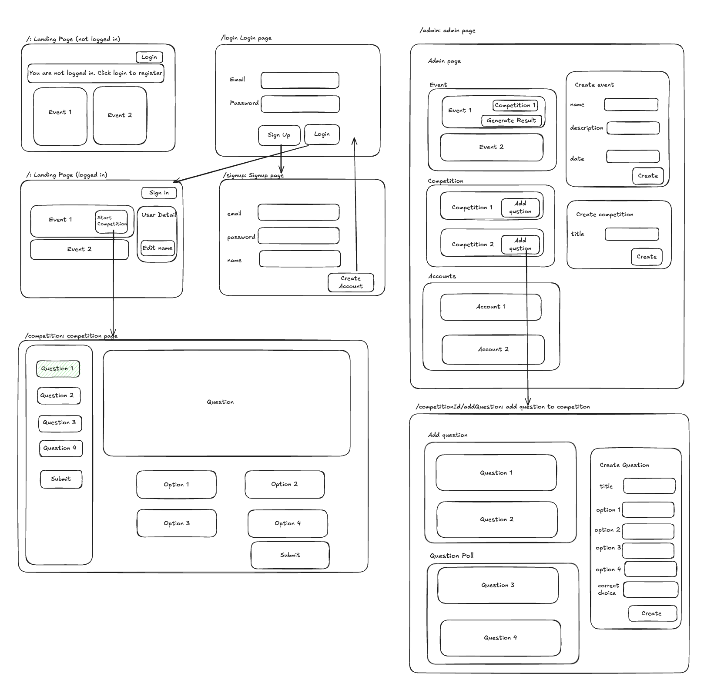

# NZPMC Competition Platform Backend

This is a competition platform demo which support logging, register for events, join competition, an admin pane and much more.

### wireframe



### Live Demo

Live Demo: only for registration module
https://nzpmc-registration-platform-backend.onrender.com
Note: It may take 1-3 mins because I am on free tier

### Front End code

https://github.com/Harry-Sheng/nzpmc-registration-platform-frontend

## CodeBase Structure

Front End

```
src
  assets
  components
  context
  pages
  services
  style

app.jsx
main.jsx
```

- **assets**  
   Stores images.
- **components**  
   Reusable UI components and forms that can be shared across multiple pages.
- **context**  
   Create global state for user login information using react context
- **pages**  
   Defines top-level page components. Each page corresponds to a route within the app except landingPageLogged and landingPageNotLogged they corresponds to logged/notLogged state of landing page.
- **services**  
   Encapsulates logic for interacting with APIs or back-end systems. These modules manage data fetching, authentication, and other business logic.
- **style**  
   Holds style for navigation bar. For other components I user react bootstrap so this is the only css file in this folder.
- **App.jsx**  
   The root-level component that sets up the overall structure and routing of the application.
- **main.jsx**  
   The entry point of the React application. Renders the `App` component into the DOM, initializing the app in the browser.

Back End

```
In progress
```

### Extra Features

-JWT Authentication:
Using JWT (JSON Web Token) is a straightforward and widely adopted method for handling user authentication in SPAs. It simplifies the token exchange process between frontend and backend, avoids storing sessions on the server, and integrates well with React Context for maintaining logged-in states.

-React Context for Authentication:
Context allows the authentication state to be easily accessed across components without manual prop passing. This streamlines user experience in scenarios like conditional rendering of navigation items, access to restricted pages, and form submissions that require authentication.

-React Bootstrap and Minimal Custom CSS:
React Bootstrap provides prebuilt, responsive components that adhere to modern UI/UX standards, reducing the need for custom styling from scratch.
