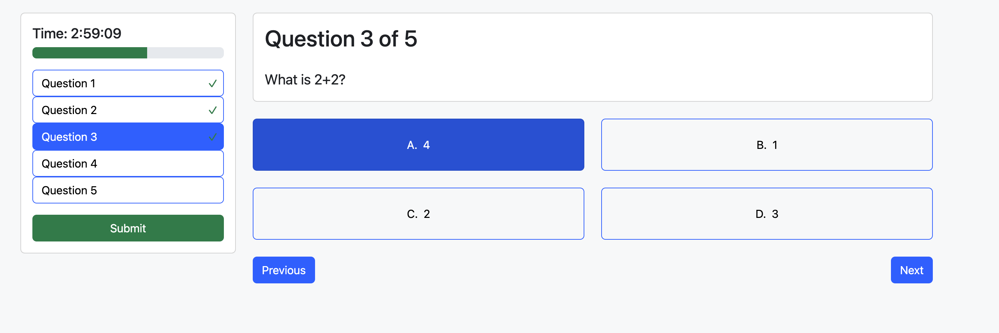

# NZPMC Competition Platform Demo

This is a competition platform demo that supports logging, registering for events, joining competitions, competing in competitions, an admin dashboard and much more. There is even a chatbot that can answer all your questions about NZPMC. Built with React, Spring Boot, and MongoDB

## Table of Contents

1. [Features](#features)
2. [Technologies Used](#technologies-used)
3. [Get Started](#get-started)
4. [CodeBase Structure](#codebase-structure)
5. [Key Decisions](#key-decisions)
6. [Images](#images)
7. [Front End code](#front-end-code)

## Features

- OpenAI chatbot integration for answering NZPMC-related questions for users.
- User register, sign in/out, and edit name.
- User able to sign up for the event.
- User able to join competitions, auto submission, timer, and progress bar.
- User authentication and authorization (JWT).
- Admin able to see results, users, competition, and events.
- Admin able to link competition to the event.
- Admin able to delete users, competitions and events.
- Admin able to create questions and add to the competition. Also able to reuse questions.
- Admin able to create completions, and events.
- Protected routes for authenticated users.
- Responsive design for desktop and mobile users using react-bootstrap.

## Technologies Used

- Frontend: React, react-context, react-Bootstrap
- Backend: Spring Boot, Spring Boot Security
- Database: MongoDB
- Authentication: JSON Web Tokens (JWT)
- Chatbot: OpenAI API

## Get Started

### Frontend

1. Clone the repository

```bash
git clone https://github.com/Harry-Sheng/nzpmc-competition-platform-frontend
```

2. Install dependencies

```bash
cd nzpmc-competition-platform-frontend
npm install
```

3. Start the development server

```bash
npm run dev
```

### Backend

1. Clone the repository

```bash
git clone https://github.com/Harry-Sheng/nzpmc-competition-platform-backend
```

2. Set environment variables

Go to resources/application.properties and set the following variables

```bash
spring.application.name={your application name}
spring.data.mongodb.url={your mongodb url}
spring.data.mongodb.database={your database name}

# JWT configuration, jwt token expires in a day
jwt.secret={your secret}
jwt.jwtExpirationMs={your expiration time}
openai.api.key = {your openai api key}
```

3. Install dependencies

```bash
cd nzpmc-competition-platform-backend/SpringBootBackend/CompetitionPlatform
./gradlew build //This should work; however, I have not tested it yet. Message me if it does not work
```

4. run the application

## CodeBase Structure

Front End

```
src
  assets     // images
  components // reusable UI components
  context    // global state management
  pages      // top-level page components
  routes     // protected routes
  services   // API interaction logic
  style      // global css
  utile      // utility functions

app.jsx      // root-level component handles routing
main.jsx     // entry point
```

Back End

```
src
  main
    java
      com.nzpmc.CompetitionPlatform
        config     // configuration classes
        controller // REST API controllers
        dto        // data transfer objects
        models     // mongodb entities
        repository // mongo repositories
        service    // service classes
```

## Key Decisions

### JWT Authentication:

- simplifies the token exchange process between frontend and backend, avoids storing sessions on the server.
- integrates well with React Context for maintaining logged-in states.
- provides a secure way to authenticate users and authorize access to protected resources.
- JWT tokens work well in distributed systems and microservices architectures. Future scalability and microservices integration are supported.

### React Context for Authentication:

- Allows the authentication state to be easily accessed across components without manual prop passing.

### React Bootstrap and Minimal Custom CSS:

- React Bootstrap provides prebuilt, responsive components that adhere to modern UI/UX standards, reducing the need for custom styling from scratch.

### OpenAI Chatbot Integration:

- Provides a conversational interface for users to ask questions and get instant responses.
- Easier for users to find information and get help.

## images





## Front End code

https://github.com/Harry-Sheng/nzpmc-competition-platform-frontend
